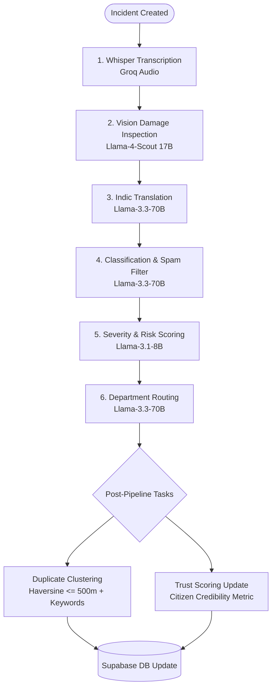

# Jan Samadhan (जन समाधान) — Complete Project & Architecture Guide

> **AI-Powered Civic Incident Management Platform for Indian Municipal Governance**  
> *Built following UX4G (User Experience for Government) design guidelines.*

---

## 📌 1. Executive Summary & The Problem It Solves

### The Problem in Civic Redressal
In municipal governance across India, public grievance systems (like municipal helplines or web portals) suffer from major operational bottlenecks:
1. **High Friction for Citizens:** Reporting an issue (potholes, water leaks, broken streetlights) requires filling long tedious forms. Most citizens prefer messaging on WhatsApp or voice notes.
2. **Language Barriers:** Grievances submitted in regional languages (Hindi, Marathi, Tamil, Telugu, Bengali) are delayed or misrouted.
3. **Floods of Duplicate Complaints:** When a major water pipe bursts or a road craters during monsoon, hundreds of citizens report the exact same issue, overwhelming authorities.
4. **Spam & False Reporting:** Triage officers waste hours verifying fake photos, gibberish submissions, or irrelevant images (e.g. selfies, nature shots).
5. **Lack of Resolution Accountability:** Workers often close tickets without verified proof, leaving citizens frustrated.

### The Jan Samadhan Solution
**Jan Samadhan** re-imagines civic redressal as an intelligent, automated, multi-channel system:
- **WhatsApp-First & Web Intake:** Citizens can file grievances via a guided WhatsApp conversation (text, voice note, photo, GPS pin) or via a modern web portal.
- **Cognitive AI Triage (LangGraph + Groq):** Automatically transcribes regional voice notes, verifies photos for actual damage using vision models, translates Indic languages to English, auto-classifies the category, scores severity, and routes the ticket to the correct department.
- **Duplicate Clustering:** Uses spatial-temporal clustering (Haversine formula within 500m + keyword matching over a 5-day window) to automatically group duplicates under one primary ticket and escalate priority as duplicate count increases.
- **Proof-of-Resolution AI Verification:** Workers must submit an "After" photo. A Vision Language Model audits the "Before" photo vs the "After" photo to verify that work was genuinely done before a ticket can be closed.
- **Citizen Trust Scoring:** Dynamic credibility rating (0–100) that rewards valid civic reporting and flags serial spammers.

---

## 👥 2. User Roles & Experiences

The platform provides dedicated workflows and dashboards for three primary user personas:

```
                  ┌──────────────────────────────────────────────┐
                  │              JAN SAMADHAN ROLES              │
                  └──────────────────────┬───────────────────────┘
                                         │
        ┌────────────────────────────────┼────────────────────────────────┐
        ▼                                ▼                                ▼
  [ CITIZEN ]                      [ AUTHORITY ]                     [ WORKER ]
  - Web & WhatsApp Reporting       - Central Triage Dashboard        - Mobile Field Dashboard
  - Multilingual Form (6 langs)    - AI Diagnostic Inspector         - Assigned Incident Queue
  - Live Tracking by ID            - Bulk Worker Dispatch            - In-Progress Status Toggle
  - Personal Grievance Timeline    - Spatial Heatmaps & Analytics    - Before vs After Photo Proof
  - Trust Score Profile            - Physical QR Project Boards      - Automated AI Work Audit
```

### 1. Citizen
- Can file grievances via **Web Portal** or **WhatsApp**.
- Attaches photo evidence, records audio/voice notes, or drops an interactive map location pin.
- Tracks real-time status with a unique tracking code (e.g., `CR-2026-A1B2C3`).
- Switches language seamlessly (English, हिन्दी, தமிழ், తెలుగు, मराठी, বাংলা).

### 2. Authority (Municipal Admin / Officer)
- **Triage Dashboard:** Real-time stream of incoming incidents with AI confidence scores, spam flags, and category filters.
- **Expanded AI Panel:** Explains why an issue was classified as critical, shows extracted keywords, visual inspection summary, and secondary department suggestions.
- **Cluster Inspector:** Shows how many citizens reported the same issue within a 500m radius.
- **Batch Actions:** Bulk-dispatch tasks to municipal workers (PWD, Water, Electricity) with one click.
- **Analytics & Heatmaps:** Interactive Leaflet heatmap of civic hotspots and resolution turnaround metrics with Recharts.
- **QR Project Management:** Generate physical QR codes for civic infrastructure projects so citizens can scan boards on-site and report issues directly.

### 3. Field Worker (Repair Crew)
- Specialized mobile-friendly dashboard.
- Lists assigned tasks sorted by priority and proximity.
- One-click navigation to the incident GPS coordinates.
- Toggles status from `assigned` to `in-progress`.
- Resolution submission: Uploads an "After" repair photo. The AI Vision reviewer immediately analyzes whether the damage shown in the "Before" photo has been repaired.

---

## 🤖 3. The AI Cognitive Pipeline

The AI pipeline is orchestrated using **LangGraph** with resilient node-by-node fallback, running asynchronously in FastAPI background tasks.



### AI Pipeline Nodes & Models

| Step | Service Name | Model / Tech | Purpose & Logic |
|---|---|---|---|
| **1. Audio** | `TranscriptionService` | `whisper-large-v3` (Groq) | Transcribes voice notes or recorded complaint audio into raw text. |
| **2. Vision** | `VisionAnalysisService` | `meta-llama/llama-4-scout-17b-16e-instruct` | Inspects uploaded image (converted to Base64). Extracts visible damage, safety hazards, estimated dimensions, and flags irrelevant photos (selfies, flowers, animals). |
| **3. Translation** | `TranslationService` | `llama-3.3-70b-versatile` | Detects language; translates Hindi, Tamil, Telugu, Marathi, Bengali into English while preserving the original text. |
| **4. Classification & Spam** | `ClassificationService` | `llama-3.3-70b-versatile` (Structured JSON) | Categorizes into Pothole, Garbage, Streetlight, Water Leak, Noise, etc. Generates clean titles and summaries. Flags spam/gibberish. |
| **5. Severity** | `SeverityScoringService` | `llama-3.1-8b-instant` | Assigns urgency level (`Low`, `Medium`, `High`, `Critical`) and computes a risk score (0.0 – 1.0). |
| **6. Routing** | `DepartmentRoutingService`| `llama-3.3-70b-versatile` | Suggests Primary Department (e.g. Roads & Traffic) and secondary departments (e.g. Health, Electricity). |
| **7. Clustering** | `DuplicateDetectionService` | Haversine Formula + Jaccard overlap | Finds open complaints in the same category within 500m and 5 days. Groups under a primary cluster and escalates severity with volume. |
| **8. Resolution Audit** | `ResolutionVerificationService`| `meta-llama/llama-4-scout-17b-16e-instruct` | Compares the worker's "After" photo with the original "Before" photo to verify the repair before ticket closure. |
| **9. Trust Score** | `TrustScoringService` | Rule-based Heuristic | Adjusts citizen trust: +10 for verified reports, -15 for spam/rejected reports. |

---

## 🛠️ 4. Complete Tech Stack

```
Frontend:     React 18 + TypeScript + Vite + Zustand + Framer Motion + Recharts
Styling:      Tailwind CSS v4 + UX4G Government Design Tokens + Shadcn UI patterns
Backend:      FastAPI (Python 3.10+) + Uvicorn + Pydantic v2
AI / LLM:     LangGraph + LangChain + Groq Cloud (Llama 3.3, Llama 4 Scout, Whisper)
Messaging:    Twilio WhatsApp API (TwiML webhook flow)
Database:     Supabase (PostgreSQL 15 + Supabase Auth + Supabase Storage)
Maps:         Leaflet + React-Leaflet + Leaflet-Heat
```

### Detailed Breakdown

#### Frontend (`/frontend`)
- **React 18 & TypeScript:** Strict typing with modular component hierarchy.
- **Zustand:** State stores for auth (`useAuthStore`), language localization (`useLanguageStore`), sidebar state (`useSidebarStore`), and theme (`useThemeStore`).
- **Tailwind CSS v4:** Modern CSS imports using `@theme inline` with UX4G official Indian government palette (Govt Blue, Ashoka Gold, Forest Green, Saffron accents).
- **Framer Motion:** Micro-interactions and fluid card transitions.
- **Recharts & Leaflet:** Live trend charts, status distributions, and geo-incident heatmaps.

#### Backend (`/backend`)
- **FastAPI:** High-performance asynchronous REST API with Swagger documentation at `/api/docs`.
- **LangGraph:** Cyclic / acyclic directed graph orchestration for multi-stage LLM chains.
- **Supabase Python Client:** Service-role database access with Row-Level Security bypass for backend administrative operations.
- **Twilio WhatsApp Webhook Controller:** Conversational state machine that walks WhatsApp users through a 3-step reporting wizard.

---

## 🔍 5. Complete Feature Verification & Implementation Status Matrix

Every feature designed in the architecture has been verified against the codebase:

| Category | Feature | Status | Backend Implementation | Frontend UI / View |
|---|---|:---:|---|---|
| **Intake** | **Web Multilingual Report Form** | ✅ Complete | [`POST /api/v1/incidents`](file:///c:/Users/kirti/coding/PROJECTS/jansamadhan-ai/backend/app/api/incident.py) | [`ReportIncident.tsx`](file:///c:/Users/kirti/coding/PROJECTS/jansamadhan-ai/frontend/pages/citizen/ReportIncident.tsx) |
| **Intake** | **Voice Note & Audio Intake** | ✅ Complete | [`TranscriptionService`](file:///c:/Users/kirti/coding/PROJECTS/jansamadhan-ai/backend/app/ai/services/transcription_service.py) (Whisper) | Audio recorder in [`ReportIncident.tsx`](file:///c:/Users/kirti/coding/PROJECTS/jansamadhan-ai/frontend/pages/citizen/ReportIncident.tsx) |
| **Intake** | **Photo Evidence & Storage** | ✅ Complete | [`POST /api/v1/incidents/upload`](file:///c:/Users/kirti/coding/PROJECTS/jansamadhan-ai/backend/app/api/incident.py) | Drag-and-drop uploader in [`ReportIncident.tsx`](file:///c:/Users/kirti/coding/PROJECTS/jansamadhan-ai/frontend/pages/citizen/ReportIncident.tsx) |
| **Intake** | **GPS Geolocation & Map Pin** | ✅ Complete | Geopoint storage in `incidents` table | Browser GPS detection in [`ReportIncident.tsx`](file:///c:/Users/kirti/coding/PROJECTS/jansamadhan-ai/frontend/pages/citizen/ReportIncident.tsx) |
| **Intake** | **WhatsApp Conversational Bot** | ✅ Complete | [`whatsapp_webhook_controller.py`](file:///c:/Users/kirti/coding/PROJECTS/jansamadhan-ai/backend/app/whatsapp_ai/controllers/whatsapp_webhook_controller.py) | Twilio WhatsApp Sandbox / Mobile Client |
| **Auth** | **Supabase JWT Auth (RBAC)** | ✅ Complete | [`auth.py`](file:///c:/Users/kirti/coding/PROJECTS/jansamadhan-ai/backend/app/api/auth.py), [`security.py`](file:///c:/Users/kirti/coding/PROJECTS/jansamadhan-ai/backend/app/core/security.py) | [`Login.tsx`](file:///c:/Users/kirti/coding/PROJECTS/jansamadhan-ai/frontend/pages/auth/Login.tsx), [`Signup.tsx`](file:///c:/Users/kirti/coding/PROJECTS/jansamadhan-ai/frontend/pages/auth/Signup.tsx), [`ProtectedRoute.tsx`](file:///c:/Users/kirti/coding/PROJECTS/jansamadhan-ai/frontend/components/auth/ProtectedRoute.tsx) |
| **Auth** | **Aadhaar Mock Authentication** | ✅ Complete | [`POST /api/v1/auth/aadhar-login`](file:///c:/Users/kirti/coding/PROJECTS/jansamadhan-ai/backend/app/api/auth.py) | Aadhaar 12-digit OTP tab in [`Login.tsx`](file:///c:/Users/kirti/coding/PROJECTS/jansamadhan-ai/frontend/pages/auth/Login.tsx) |
| **AI** | **Computer Vision Inspection** | ✅ Complete | [`VisionAnalysisService`](file:///c:/Users/kirti/coding/PROJECTS/jansamadhan-ai/backend/app/ai/services/vision_service.py) (Llama-4-Scout) | Inspection report in [`ExpandedAiPanel.tsx`](file:///c:/Users/kirti/coding/PROJECTS/jansamadhan-ai/frontend/pages/authority/components/ExpandedAiPanel.tsx) |
| **AI** | **Fake Photo & Spam Gatekeeper** | ✅ Complete | Flagged in [`ClassificationService`](file:///c:/Users/kirti/coding/PROJECTS/jansamadhan-ai/backend/app/ai/services/classification_service.py) | Spam warning badges in [`ExpandedAiPanel.tsx`](file:///c:/Users/kirti/coding/PROJECTS/jansamadhan-ai/frontend/pages/authority/components/ExpandedAiPanel.tsx) |
| **AI** | **Indic Language Translation** | ✅ Complete | [`TranslationService`](file:///c:/Users/kirti/coding/PROJECTS/jansamadhan-ai/backend/app/ai/services/translation_service.py) (Llama-3.3-70B) | Original + English display in [`ExpandedAiPanel.tsx`](file:///c:/Users/kirti/coding/PROJECTS/jansamadhan-ai/frontend/pages/authority/components/ExpandedAiPanel.tsx) |
| **AI** | **Auto-Classification & Title** | ✅ Complete | [`ClassificationService`](file:///c:/Users/kirti/coding/PROJECTS/jansamadhan-ai/backend/app/ai/services/classification_service.py) | Category tags & AI summary in [`IncidentRow.tsx`](file:///c:/Users/kirti/coding/PROJECTS/jansamadhan-ai/frontend/pages/authority/components/IncidentRow.tsx) |
| **AI** | **Severity & Urgency Scoring** | ✅ Complete | [`SeverityScoringService`](file:///c:/Users/kirti/coding/PROJECTS/jansamadhan-ai/backend/app/ai/services/severity_scoring_service.py) (Llama-3.1-8B) | [`SeverityBadge.tsx`](file:///c:/Users/kirti/coding/PROJECTS/jansamadhan-ai/frontend/components/shared/SeverityBadge.tsx) |
| **AI** | **Department Routing** | ✅ Complete | [`DepartmentRoutingService`](file:///c:/Users/kirti/coding/PROJECTS/jansamadhan-ai/backend/app/ai/services/department_routing_service.py) | Dept badges & dispatch modal in [`AuthorityDashboard.tsx`](file:///c:/Users/kirti/coding/PROJECTS/jansamadhan-ai/frontend/pages/authority/Dashboard.tsx) |
| **AI** | **Resilient Pipeline Runner** | ✅ Complete | [`process_incident_ai_background`](file:///c:/Users/kirti/coding/PROJECTS/jansamadhan-ai/backend/app/ai/tasks.py) | Real-time status in [`AuthorityDashboard.tsx`](file:///c:/Users/kirti/coding/PROJECTS/jansamadhan-ai/frontend/pages/authority/Dashboard.tsx) |
| **Operations** | **Duplicate Clustering (Phase 3)**| ✅ Complete | [`DuplicateDetectionService`](file:///c:/Users/kirti/coding/PROJECTS/jansamadhan-ai/backend/app/ai/services/duplicate_detection_service.py) | Cluster badges & duplicate filters in [`DashboardFilters.tsx`](file:///c:/Users/kirti/coding/PROJECTS/jansamadhan-ai/frontend/pages/authority/components/DashboardFilters.tsx) |
| **Operations** | **Authority Bulk Actions** | ✅ Complete | [`PUT /api/v1/incidents/status`](file:///c:/Users/kirti/coding/PROJECTS/jansamadhan-ai/backend/app/api/incident.py) | [`BatchActionBar.tsx`](file:///c:/Users/kirti/coding/PROJECTS/jansamadhan-ai/frontend/pages/authority/components/BatchActionBar.tsx) |
| **Operations** | **Worker Assignment & Dispatch** | ✅ Complete | [`PUT /api/v1/incidents/{id}/status`](file:///c:/Users/kirti/coding/PROJECTS/jansamadhan-ai/backend/app/api/incident.py) | [`ConfirmDispatchDialog.tsx`](file:///c:/Users/kirti/coding/PROJECTS/jansamadhan-ai/frontend/pages/authority/components/ConfirmDispatchDialog.tsx) |
| **Operations** | **Proof-of-Resolution AI Audit** | ✅ Complete | [`ResolutionVerificationService`](file:///c:/Users/kirti/coding/PROJECTS/jansamadhan-ai/backend/app/ai/services/resolution_verification_service.py) | Before vs After verification in [`WorkerDashboard.tsx`](file:///c:/Users/kirti/coding/PROJECTS/jansamadhan-ai/frontend/pages/worker/Dashboard.tsx) |
| **Trust** | **Citizen Trust Scoring (Phase 4)**| ✅ Complete | [`TrustScoringService`](file:///c:/Users/kirti/coding/PROJECTS/jansamadhan-ai/backend/app/ai/services/trust_scoring_service.py) | Trust badge & score on [`CitizenDashboard.tsx`](file:///c:/Users/kirti/coding/PROJECTS/jansamadhan-ai/frontend/pages/citizen/Dashboard.tsx) |
| **Notifications** | **In-App Alerts & Audit Trail** | ✅ Complete | [`notifications.py`](file:///c:/Users/kirti/coding/PROJECTS/jansamadhan-ai/backend/app/api/notifications.py), [`notification_service.py`](file:///c:/Users/kirti/coding/PROJECTS/jansamadhan-ai/backend/app/services/notification_service.py) | Header notification popover & updates timeline |
| **Analytics** | **Geospatial Hotspot Heatmaps** | ✅ Complete | Coordinates queried from `incidents` | [`HeatmapLayer.tsx`](file:///c:/Users/kirti/coding/PROJECTS/jansamadhan-ai/frontend/components/shared/HeatmapLayer.tsx) on Leaflet Map |
| **Analytics** | **Executive Charts & KPI Cards** | ✅ Complete | Aggregate metrics calculation | Recharts Pie, Bar, and Area charts in [`Analytics.tsx`](file:///c:/Users/kirti/coding/PROJECTS/jansamadhan-ai/frontend/pages/authority/Analytics.tsx) |
| **QR Code** | **Civic Project Boards & Tracking**| ✅ Complete | [`qr_projects.py`](file:///c:/Users/kirti/coding/PROJECTS/jansamadhan-ai/backend/app/api/qr_projects.py) | Authority management in [`QrProjects.tsx`](file:///c:/Users/kirti/coding/PROJECTS/jansamadhan-ai/frontend/pages/authority/QrProjects.tsx), Public tracker in [`QrTracker.tsx`](file:///c:/Users/kirti/coding/PROJECTS/jansamadhan-ai/frontend/pages/public/QrTracker.tsx) |
| **i18n** | **6-Language Localization** | ✅ Complete | Supported languages: EN, HI, TA, TE, MR, BN | [`useLanguageStore.ts`](file:///c:/Users/kirti/coding/PROJECTS/jansamadhan-ai/frontend/store/useLanguageStore.ts) & [`translations/`](file:///c:/Users/kirti/coding/PROJECTS/jansamadhan-ai/frontend/lib/translations) |

---

## 📁 6. Repository Structure & Map

```
jansamadhan-ai/
├── README.md                      # Project quick-start
├── PROJECT_GUIDE.md               # This comprehensive guide
├── CODEBASE_ANALYSIS.md           # In-depth architectural audit document
├── setup.md                       # Developer setup walkthrough
│
├── backend/                       # FastAPI Backend
│   ├── app/
│   │   ├── main.py                # App entrypoint, CORS & router registrations
│   │   ├── core/
│   │   │   ├── config.py          # Environment settings (Pydantic BaseSettings)
│   │   │   ├── database.py        # Supabase client factory
│   │   │   └── security.py        # JWT auth & user profile dependency injection
│   │   ├── api/                   # REST API routes
│   │   │   ├── auth.py            # Login, signup, Aadhaar auth, worker list
│   │   │   ├── incident.py        # Incident CRUD, uploads, triage, status updates
│   │   │   ├── qr_projects.py     # Civic project QR management
│   │   │   ├── ai.py              # Direct translate & classify endpoints
│   │   │   └── notifications.py   # In-app notifications
│   │   ├── ai/                    # AI Engine & Services
│   │   │   ├── tasks.py           # Background pipeline runner & resilient fallback
│   │   │   ├── models/            # Graph state and Pydantic structured output models
│   │   │   └── services/          # Vision, classification, routing, dedup, resolution
│   │   ├── schemas/               # Pydantic request/response validation schemas
│   │   ├── services/              # Business logic services (Incident, Notification)
│   │   └── whatsapp_ai/           # Twilio WhatsApp conversational bot & parser
│   ├── migrations/                # Supabase SQL migrations (clustering, trust score)
│   ├── tests/                     # Pipeline tests & trace tests
│   ├── requirements.txt           # Python dependencies
│   ├── seed_workers.py            # Script to seed mock department workers
│   └── test_groq_vision.py        # Isolated vision test script
│
└── frontend/                      # React 18 + Vite Frontend
    ├── App.tsx                    # Root component with Toaster and routing
    ├── main.tsx                   # React DOM render and theme bootstrap
    ├── routes.tsx                 # Role-based protected routing (Citizen, Authority, Worker)
    ├── index.css                  # Tailwind v4 + UX4G design tokens
    ├── pages/
    │   ├── auth/                  # Login & Signup pages
    │   ├── public/                # Landing page & Public QR Tracker
    │   ├── citizen/               # Citizen Dashboard & Report Incident wizard
    │   ├── authority/             # Authority Dashboard, Batch Bar, AI panel, Analytics
    │   ├── worker/                # Field Worker Dashboard & Resolution submission
    │   └── shared/                # Incidents list & User settings
    ├── components/                # Modular UI, Auth, Layout, and Shared components
    ├── store/                     # Zustand stores (Auth, Language, Theme, Sidebar)
    ├── lib/                       # API helpers, Supabase client, translations (6 langs)
    └── types/                     # TypeScript definitions for entities & statuses
```

---

## 🚀 7. Step-by-Step Developer Setup Guide

Share these steps with your friend to get the project running locally in under 10 minutes:

### Prerequisites
1. **Node.js** (v18+) & **npm**
2. **Python** (v3.10+)
3. **Supabase Account** (Free tier database + auth)
4. **Groq Cloud API Key** (Free tier at [console.groq.com](https://console.groq.com))
5. *(Optional)* **Twilio Account** (For WhatsApp testing)

---

### Step 1: Backend Setup
Open a terminal in the project root:

```bash
cd backend

# 1. Create and activate virtual environment
python -m venv venv

# Windows:
venv\Scripts\activate
# macOS/Linux:
source venv/bin/activate

# 2. Install dependencies
pip install -r requirements.txt

# 3. Create your .env file
cp .env.example .env
```

Edit `backend/.env` with your credentials:
```env
SUPABASE_URL=https://your-project.supabase.co
SUPABASE_SERVICE_ROLE_KEY=eyJh... # Supabase Service Role Key (bypasses RLS)
SUPABASE_JWT_SECRET=your-jwt-secret
GROQ_API_KEY=gsk_your_groq_key

# Optional (for WhatsApp):
TWILIO_ACCOUNT_SID=your-sid
TWILIO_AUTH_TOKEN=your-token
TWILIO_PHONE_NUMBER=whatsapp:+14155238886
```

**Run Database Migrations:**
Open your Supabase SQL Editor and execute:
1. The base tables (`users`, `incidents`, `incident_ai_metadata`)
2. [`backend/migrations/003_add_clustering_columns.sql`](file:///c:/Users/kirti/coding/PROJECTS/jansamadhan-ai/backend/migrations/003_add_clustering_columns.sql)
3. [`backend/migrations/004_phase4.sql`](file:///c:/Users/kirti/coding/PROJECTS/jansamadhan-ai/backend/migrations/004_phase4.sql)

**Seed Test Workers (Optional but recommended):**
```bash
python seed_workers.py
```
*(Creates worker accounts: `pwd@gov.in`, `water@gov.in`, `electric@gov.in` with password `password123`).*

**Start Backend Server:**
```bash
uvicorn app.main:app --host 0.0.0.0 --port 8001 --reload
```
- API Docs will be live at: [http://localhost:8001/api/docs](http://localhost:8001/api/docs)
- Health Check: [http://localhost:8001/health](http://localhost:8001/health)

---

### Step 2: Frontend Setup
Open a second terminal window:

```bash
cd frontend

# Install dependencies
npm install

# Create environment configuration
cp .env.example .env.local
```

Edit `frontend/.env.local`:
```env
VITE_SUPABASE_URL=https://your-project.supabase.co
VITE_SUPABASE_ANON_KEY=eyJh... # Anon / Public Key
VITE_API_URL=http://localhost:8001
```

**Start Frontend Server:**
```bash
npm run dev
```
- Web Application will be live at: [http://localhost:5173](http://localhost:5173)

---

## 🧪 8. How to Test Key Features Quickly

1. **Verify AI Pipeline in Isolation (Without UI):**
   ```bash
   cd backend
   python tests/test_pipeline.py
   ```
   *Runs test complaints through Whisper, Vision, Translation, Classification, and Severity scoring.*

2. **Test Citizen Incident Reporting:**
   - Go to [http://localhost:5173](http://localhost:5173).
   - Sign up or log in as a citizen.
   - Click **Report Incident**, type a description (e.g. in Hindi: *"गांधी रोड पर बहुत बड़ा गड्ढा है जिससे गाड़ियाँ गिर रही हैं"*), upload a photo, and click Submit.
   - Watch the backend logs as the LangGraph pipeline transcribes, translates, classifies as `Pothole`, scores `High Risk`, and routes to `Roads & Traffic`.

3. **Test Authority Triage & Worker Dispatch:**
   - Log in as an authority user.
   - Open the **Dashboard**: see the AI analysis breakdown, keywords, and detected damage.
   - Click **Dispatch Worker**, select `Rajesh Kumar (PWD)`, and confirm.

4. **Test Worker Resolution Proof & AI Audit:**
   - Log in as `pwd@gov.in` with password `password123`.
   - See the assigned ticket in **Worker Dashboard**.
   - Mark as `in-progress`, then click `Resolve`.
   - Upload an "After" repair photo. The AI Vision reviewer checks the repair against the original photo before marking it resolved.

---

## 💡 9. Key Highlights to Pitch to Anyone

- **Not Just an LLM Wrapper:** Combines multimodal vision models (Llama 4 Scout), audio transcription, and structured NLP with geospatial math (Haversine formula) for real-world municipal operations.
- **Resilient AI Pipeline:** Even if vision or transcription drops, the pipeline degrades gracefully node-by-node and saves partial results without crashing.
- **True Civic Governance Standard:** Adheres to India's official **UX4G** standards with full localization in 6 Indian languages.
- **Closed-Loop Verification:** Solves the #1 problem in public works: verifying that municipal workers actually completed the physical repairs before closing public tickets.
