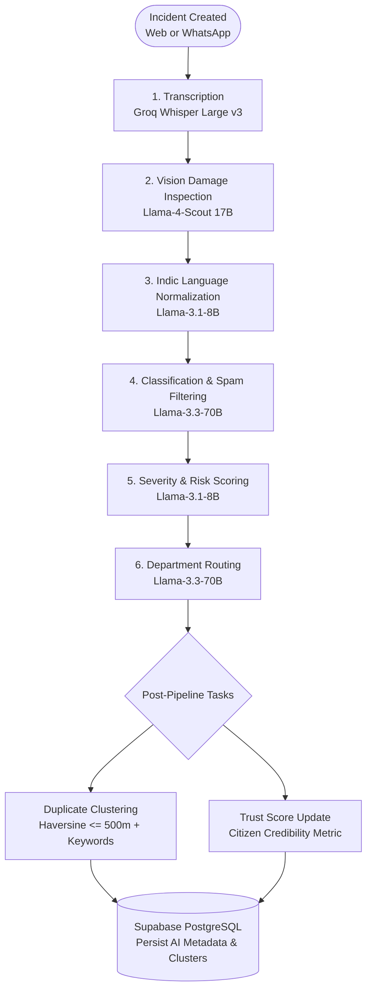

# Jan Samadhan (जन समाधान) 🇮🇳
### AI-Powered Civic Grievance Redressal & Resolution Platform

[](https://fastapi.tiangolo.com)
[](https://reactjs.org)
[](https://www.typescriptlang.org/)
[](https://langchain-ai.github.io/langgraph/)
[](https://groq.com)
[](https://supabase.com)
[](https://doc.ux4g.gov.in)
[](https://opensource.org/licenses/MIT)

**Jan Samadhan** (meaning *"Public Solution"* in Hindi) is a next-generation civic incident management platform designed for Indian municipal governance. Adhering to the Government of India's **UX4G (User Experience for Government)** design standards, it unifies citizen reporting across web and WhatsApp channels, orchestrates automated multimodal AI classification, clusters duplicate incidents, and guarantees closed-loop accountability through automated proof-of-work computer vision audits.

---

## 📑 Table of Contents

- [Key Capabilities](#-key-capabilities)
- [The Cognitive AI Pipeline](#-the-cognitive-ai-pipeline)
- [Role-Based Workflows](#-role-based-workflows)
- [System Architecture](#-system-architecture)
- [Tech Stack](#-tech-stack)
- [Repository Structure](#-repository-structure)
- [Quick Start Guide](#-quick-start-guide)
  - [Prerequisites](#prerequisites)
  - [1. Backend Setup](#1-backend-setup)
  - [2. Frontend Setup](#2-frontend-setup)
  - [3. Database Migrations & Seeding](#3-database-migrations--seeding)
- [Verification & Quality Gates](#-verification--quality-gates)
- [Security & Production Hardening](#-security--production-hardening)
- [API Overview](#-api-overview)
- [Design Standards (UX4G)](#-design-standards-ux4g)
- [Contributing & License](#-contributing--license)

---

## 🌟 Key Capabilities

* 📱 **Omnichannel Citizen Intake**: Submit grievances via a modern web app or through a guided WhatsApp conversational wizard using text, audio voice notes, photo evidence, and live GPS pins.
* 🌐 **Real-time Indic Language Translation**: Seamlessly handles submissions in **Hindi (हिन्दी)**, **Tamil (தமிழ்)**, **Telugu (తెలుగు)**, **Marathi (मराठी)**, **Bengali (বাংলা)**, and **English**, normalizing text while preserving the citizen's original wording.
* 🎙️ **Voice Note Processing**: Groq-accelerated Whisper model transcribes regional audio complaints into text directly within the ingestion pipeline.
* 👁️ **Computer Vision Damage Assessment**: Inspects uploaded damage photos via **Llama-4-Scout (17B)** to verify infrastructure hazards, estimate physical dimensions, and reject non-civic spam (such as selfies or stock photos).
* 🔍 **Spatial-Temporal Duplicate Clustering**: Employs the Haversine distance formula ($\le 500\text{ m}$) coupled with keyword similarity over a 5-day sliding window to automatically merge duplicate complaints under a primary incident, boosting priority as report counts rise.
* 🛠️ **Proof-of-Resolution AI Audit**: When field workers mark an incident resolved, they must upload an "After" photo. The system runs an automated side-by-side vision evaluation against the original "Before" photo, ensuring physical repairs are verified before ticket closure.
* ⭐ **Citizen Credibility Rating**: Dynamic trust scoring (0–100) rewards constructive civic reporting (+10 on verified resolution) and discourages spam (-15 on rejected submissions).
* 📊 **Authority Intelligence & Heatmaps**: Interactive Leaflet geospatial heatmaps and Recharts analytics give municipal administrators instant visibility into civic hotspots and department turnaround metrics.
* 🏷️ **Physical QR Code Project Boards**: Citizens can scan on-site QR codes attached to public works projects to view budgets, contractor details, and log location-specific issues.

---

## 🤖 The Cognitive AI Pipeline

Jan Samadhan leverages **LangGraph** to execute a resilient, multi-stage directed graph running in asynchronous FastAPI background tasks:



### Pipeline Node Specification

| Node | Service Name | Model / Engine | Responsibilities |
|---|---|---|---|
| **1. Audio** | `TranscriptionService` | `whisper-large-v3` | Transcribes audio recordings and voice notes into text. |
| **2. Vision** | `VisionAnalysisService` | `meta-llama/llama-4-scout-17b` | SSRF-guarded image fetching, structural damage detection, safety hazard flagging, relevance check. |
| **3. Translation** | `TranslationService` | `llama-3.1-8b-instant` | Language detection and translation of 6 Indic languages to English. |
| **4. Classification** | `ClassificationService` | `llama-3.3-70b-versatile` | Structured JSON classification (Pothole, Sanitation, Water, Electricity, etc.), title/summary generation, spam detection. |
| **5. Severity** | `SeverityScoringService` | `llama-3.1-8b-instant` | Risk calculation (0.0 to 1.0) and urgency assignment (`low`, `medium`, `high`, `critical`). |
| **6. Routing** | `DepartmentRoutingService` | `llama-3.3-70b-versatile` | Suggests primary and secondary municipal departments (e.g., Roads & Traffic, Health, Utilities). |
| **7. Clustering** | `DuplicateDetectionService` | Haversine + Jaccard Overlap | Identifies duplicate reports within 500m and groups them under a master cluster. |
| **8. Resolution** | `ResolutionVerificationService` | `meta-llama/llama-4-scout-17b` | Compares worker "After" photo with original "Before" photo; tri-state verification (`verified`, `rejected`, `error`). |

---

## 👥 Role-Based Workflows

```
                               ┌─────────────────────────────────┐
                               │       JAN SAMADHAN ROLES        │
                               └────────────────┬────────────────┘
                                                │
                 ┌──────────────────────────────┼──────────────────────────────┐
                 ▼                              ▼                              ▼
          [ 🏛️ CITIZEN ]                [ 🏢 AUTHORITY ]               [ 👷 FIELD WORKER ]
      - Web & WhatsApp reporting    - Central triage dashboard      - Mobile-first task list
      - Audio, photo, GPS pin       - AI diagnostic inspector       - GPS turn-by-turn navigation
      - Live tracking (CIV-ID)      - Bulk worker dispatch          - In-progress status update
      - Personal timeline           - Geo heatmaps & Recharts       - Before vs After photo proof
      - Dynamic trust score         - QR project management         - Automated AI repair check
```

---

## 🏛️ System Architecture

```
┌─────────────────────────────────────────────────────────────────────────┐
│                           FRONTEND (React 18 + Vite)                    │
│                                                                         │
│   Citizen Portal         Authority Dashboard          Worker Field App  │
│   (Report, Track, Audio) (Triage, Analytics, QR)     (Tasks, Proof Cam) │
│           │                       │                           │         │
│           └───────────────────────┼───────────────────────────┘         │
│                                   ▼                                     │
│                     Zustand State Stores & Axios API                    │
│                      UX4G Design System + Tailwind                      │
└───────────────────────────────────┬─────────────────────────────────────┘
                                    │ HTTP REST + JWT
                                    ▼
┌─────────────────────────────────────────────────────────────────────────┐
│                           BACKEND (FastAPI API)                         │
│                                                                         │
│   /api/v1/auth          /api/v1/incidents            /api/v1/qr-projects│
│   /api/v1/notifications /api/webhooks/whatsapp       /api/v1/ai         │
│                                   │                                     │
│   FastAPI Request Logging ────────┼─────────── Token & RBAC Security    │
│                                   ▼                                     │
│                 FastAPI Asynchronous BackgroundTasks                    │
│                                   │                                     │
│       ┌───────────────────────────┴───────────────────────────┐         │
│       ▼                                                       ▼         │
│  LangGraph Engine (Groq Cloud)                      Twilio WhatsApp     │
│  Whisper • Llama-4-Scout • Llama-3.3                Conversational Bot  │
└───────────────────────────────────┬─────────────────────────────────────┘
                                    │
                                    ▼
┌─────────────────────────────────────────────────────────────────────────┐
│                           DATABASE & STORAGE                            │
│                        Supabase (PostgreSQL 15)                         │
│                                                                         │
│   • users (RBAC & Trust Score)          • incidents (Mirrored Coords)   │
│   • incident_ai_metadata                • resolution_verifications      │
│   • notifications                       • qr_projects & incidents       │
│   • Supabase Storage (Buckets: grievance_images)                        │
└─────────────────────────────────────────────────────────────────────────┘
```

---

## 🛠️ Tech Stack

### Frontend
* **Framework**: React 18 with TypeScript, bundled via Vite.
* **State Management**: Zustand stores (`useAuthStore`, `useLanguageStore`, `useSidebarStore`, `useThemeStore`).
* **Styling**: Tailwind CSS v4 featuring UX4G Government Continuity Design Tokens.
* **Visuals & Charts**: Recharts for metrics, Leaflet & React-Leaflet for geospatial heatmaps.
* **Micro-interactions**: Framer Motion, Radix UI primitives, Lucide React icons, and Sonner notifications.

### Backend
* **API Framework**: FastAPI (Python 3.10+) running on ASGI Uvicorn.
* **AI Orchestration**: LangGraph, LangChain Core, and Groq SDK.
* **AI Inference**: Groq Cloud (`llama-3.3-70b-versatile`, `llama-3.1-8b-instant`, `llama-4-scout-17b`, `whisper-large-v3`).
* **Messaging**: Twilio WhatsApp API (TwiML webhook flow).
* **Database & Auth**: Supabase PostgreSQL with Row Level Security (RLS) & Supabase Storage.
* **Validation & Settings**: Pydantic v2 & Pydantic Settings.

---

## 📁 Repository Structure

```
jansamadhan-ai/
├── backend/                       # FastAPI Python Backend
│   ├── app/
│   │   ├── main.py                # FastAPI factory, CORS, and router registration
│   │   ├── core/                  # Configuration, database singleton, security, logging
│   │   ├── api/                   # REST routes: auth, incident, qr_projects, ai, notifications
│   │   ├── ai/                    # LangGraph pipeline, background tasks, Groq AI services
│   │   ├── schemas/               # Pydantic request and response schemas
│   │   ├── services/              # Business domain services (Incident, Notification, Resolution)
│   │   └── whatsapp_ai/           # Twilio webhook controller, session manager, media services
│   ├── migrations/                # Supabase SQL migrations (001 to 008)
│   ├── tests/                     # Pytest automated test suite (145 tests)
│   ├── seed_workers.py            # Department worker seed script
│   └── requirements.txt           # Production dependencies
│
├── frontend/                      # React 18 + TypeScript + Vite Frontend
│   ├── pages/                     # Citizen, Authority, Worker, Public, and Auth views
│   ├── components/                # Modular UI primitives, layout, and role guards
│   ├── store/                     # Zustand state stores
│   ├── lib/                       # API helpers, translation barrels (6 languages)
│   ├── index.css                  # Tailwind v4 + UX4G design tokens
│   └── tests/                     # Frontend unit and route-guard tests
│
├── .github/workflows/             # CI/CD workflows (pytest, ruff, vulture, tsc, knip, build)
├── PROJECT_GUIDE.md               # Detailed architecture guide and pitch notes
├── CODEBASE_ANALYSIS.md           # In-depth architectural audit
├── CURRENT_CODEBASE_REPORT.md     # Hardening & verification audit report
├── DEAD_CODE_REGISTER.md          # Unused and parked code registry
└── remaining.md                   # Deployment readiness checklist
```

---

## 🚀 Quick Start Guide

### Prerequisites
* **Node.js** $\ge 18.0.0$ and **npm** $\ge 9.0.0$
* **Python** $\ge 3.10$ and **pip** (or `uv`)
* A **Supabase** project (PostgreSQL + Auth + Storage)
* A **Groq Cloud API Key** (from [console.groq.com](https://console.groq.com))
* *(Optional)* **Twilio Account** (for live WhatsApp intake)

---

### 1. Backend Setup

```bash
cd backend

# Create and activate virtual environment
python -m venv .venv

# On Windows:
.venv\Scripts\activate
# On Linux / macOS:
source .venv/bin/activate

# Install dependencies
pip install -r requirements.txt
pip install -r requirements-dev.txt

# Configure environment variables
cp .env.example .env
```

Edit `backend/.env` with your credentials:
```env
SUPABASE_URL=https://your-project.supabase.co
SUPABASE_SERVICE_ROLE_KEY=eyJh... # Supabase Service Role Key (bypasses RLS for admin)
SUPABASE_JWT_SECRET=your-jwt-secret
GROQ_API_KEY=gsk_...
ENVIRONMENT=development
DEV_AUTH_BYPASS=true

# Optional Twilio parameters for WhatsApp:
TWILIO_ACCOUNT_SID=your-sid
TWILIO_AUTH_TOKEN=your-token
TWILIO_PHONE_NUMBER=whatsapp:+14155238886
```

Start the backend API server:
```bash
uvicorn app.main:app --host 0.0.0.0 --port 8001 --reload
```
* **API Documentation**: [http://localhost:8001/api/docs](http://localhost:8001/api/docs)
* **Health Check**: [http://localhost:8001/health](http://localhost:8001/health)

---

### 2. Frontend Setup

Open a new terminal session:

```bash
cd frontend

# Install dependencies
npm install

# Configure environment variables
cp .env.example .env.local
```

Edit `frontend/.env.local`:
```env
VITE_SUPABASE_URL=https://your-project.supabase.co
VITE_SUPABASE_ANON_KEY=eyJh... # Supabase Anon Key (safe for browser)
```

Start the Vite development server:
```bash
npm run dev
```
* **Web Portal**: [http://localhost:5173](http://localhost:5173)

---

### 3. Database Migrations & Seeding

1. Open your **Supabase Project Dashboard $\to$ SQL Editor**.
2. Execute the migration scripts located in `backend/migrations/` in sequence:
   * `001_initial_schema.sql` (Base tables: users, incidents, notifications)
   * `002_ai_metadata.sql` (AI columns, classification fields)
   * `003_add_clustering_columns.sql` (Duplicate detection metadata)
   * `004_phase4.sql` (Resolution verification & trust scores)
   * `005_schema_alignment.sql` (QR projects & incident relations)
   * `006_resolution_pending.sql` (Pending resolution verification states)
   * `007_atomic_resolution.sql` (Defines atomic `finalize_resolution` RPC)
   * `008_updated_at_trigger.sql` (Automated `updated_at` trigger)
3. Seed mock departmental workers:
   ```bash
   cd backend
   python seed_workers.py
   ```

#### Default Test Accounts
| Role | Email | Password |
|---|---|---|
| **Citizen** | `citizen@gov.in` | `password123` |
| **Authority** | `authority@gov.in` | `password123` |
| **Worker (PWD)** | `pwd@gov.in` | `password123` |
| **Worker (Water)** | `water@gov.in` | `password123` |
| **Worker (Electricity)** | `electric@gov.in` | `password123` |

---

## 🧪 Verification & Quality Gates

The repository includes a comprehensive testing and linting suite covering all layers:

### Backend Checks
```bash
cd backend
.venv\Scripts\python.exe -m pytest -q                        # 145 unit tests pass
.venv\Scripts\python.exe -m pytest tests/test_authorization_sweep.py -q # 12 RBAC tests
.venv\Scripts\python.exe -m ruff check .                     # Zero lint findings
.venv\Scripts\python.exe -m vulture app vulture_whitelist.py --min-confidence 60 # Dead-code check
```

### Frontend Checks
```bash
cd frontend
npx tsc -b --force             # TypeScript compilation (zero errors)
npm run knip:ci                # Dead-code & export check (exit 0)
node --test tests/*.test.cjs   # Component & route-guard unit tests (3 pass)
npm run build                  # Production build compilation
```

---

## 🔒 Security & Production Hardening

Jan Samadhan has completed a rigorous 7-phase hardening sweep:

1. **Authentication & Identity**:
   * Removed unauthenticated fallback to authority roles; invalid or expired JWTs strictly return HTTP `401 Unauthorized`.
   * Development bypass is explicitly locked down: requires `ENVIRONMENT != production` **AND** `DEV_AUTH_BYPASS=true`.
2. **Access Control & BOLA Protection**:
   * Workers can only inspect and update tasks explicitly assigned to them.
   * Incident update timeline notes and proof URLs are restricted to authorized personnel.
   * Mock worker assignment is strictly development-only (rejected with `422` in production).
3. **Resolution Integrity**:
   * Photo proof is mandatory for marking incidents resolved.
   * Llama-4-Scout executes an explicit tri-state inspection (`verified | rejected | error`). Provider timeouts or network failures never incorrectly mark a repair as rejected.
   * Atomic ticket closure via PostgreSQL RPC (`finalize_resolution`) rolls back updates if audit logging fails.
4. **Resilient WhatsApp Management**:
   * MessageSid deduplication enforced with a 1-hour TTL and a 10,000-entry cap.
   * Session state bound to 5,000 active sessions with automatic LRU eviction.
   * Single-point Twilio signature verification that fails closed when auth tokens are missing.
5. **Transactional Audit Logging**:
   * Status change audits are written *before* the state update, with automatic compensation if the update fails.

---

## 📡 API Overview

The FastAPI backend provides auto-generated OpenAPI documentation accessible at `/api/docs`:

```
POST   /api/v1/auth/login                  - Authenticate user & issue JWT
POST   /api/v1/auth/signup                 - Citizen registration (forces role=citizen)
POST   /api/v1/auth/aadhar-login           - Aadhaar OTP authentication tab
GET    /api/v1/auth/workers                - List departmental field workers (Authority only)

POST   /api/v1/incidents                   - Create incident (Triggers AI pipeline)
GET    /api/v1/incidents                   - List incidents (Role-filtered)
GET    /api/v1/incidents/{id}              - Fetch incident details & AI breakdown
PUT    /api/v1/incidents/{id}/status       - Update status & upload proof (Worker/Authority)
PUT    /api/v1/incidents/{id}/triage       - Override AI category, severity, department
POST   /api/v1/incidents/upload            - Secure image upload (MIME & size validated)
GET    /api/v1/incidents/{id}/updates      - Retrieve timeline audit trail
POST   /api/v1/incidents/{id}/reprocess    - Re-trigger AI pipeline analysis

POST   /api/v1/qr-projects                 - Create civic project tracking board
GET    /api/v1/qr-projects/{id}            - Public project status query
POST   /api/webhooks/whatsapp              - Twilio incoming WhatsApp webhook
GET    /api/v1/notifications               - List user notifications
GET    /health                             - System health probe
```

---

## 🎨 Design Standards (UX4G)

The user interface follows the official **UX4G (User Experience for Government)** standard developed by the National e-Governance Division (NeGD) and Ministry of Electronics & Information Technology (MeITy):
* **Official Palette**: Govt Navy Blue (`#1E3A8A`), Ashoka Gold (`#D97706`), Forest Green (`#059669`), and Saffron accents.
* **Continuity Tokens**: Pre-declared Bootstrap-compatible spacer scales and shadow elevations without unlayered CSS conflicts.
* **Accessibility**: Full keyboard navigability, high-contrast text ratios, screen-reader support, and `prefers-reduced-motion` compliance.

---

## 📄 Contributing & License

Contributions are welcome! Please ensure all backend unit tests (`pytest`), frontend typechecks (`tsc`), and dead-code checks (`knip`) pass before opening a pull request.

This project is licensed under the **MIT License** — see the [LICENSE](LICENSE) file for details.

© 2026 **Jan Samadhan Team** · Built with pride for Indian Civic Governance 🇮🇳
