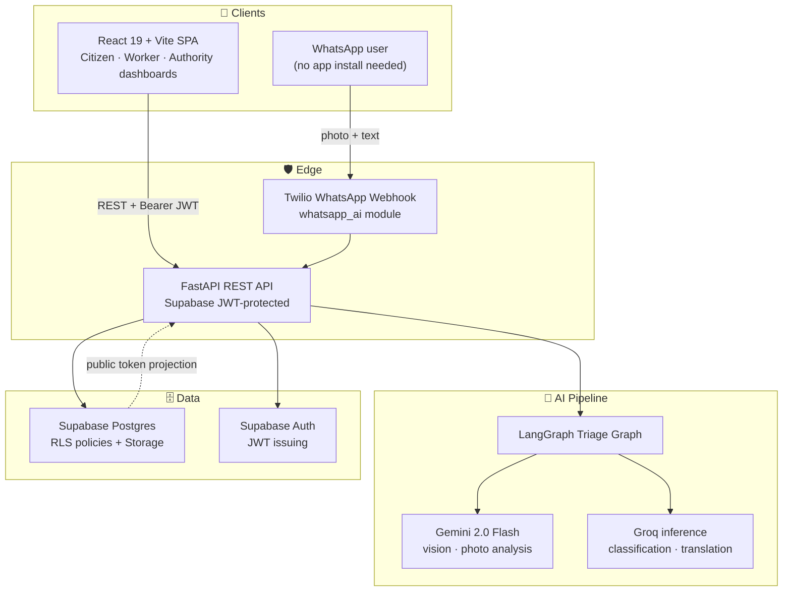
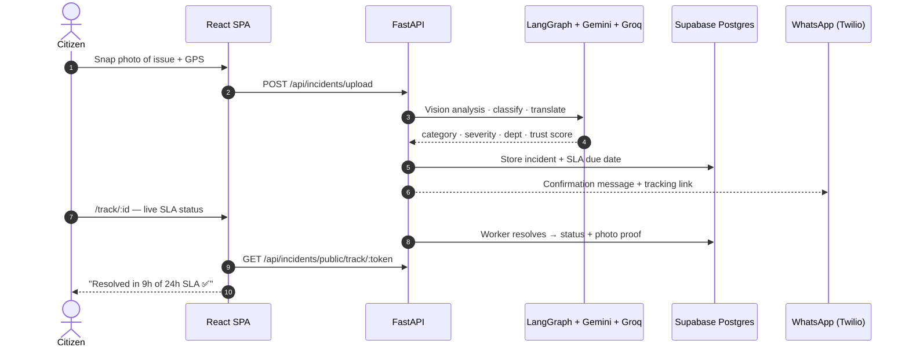
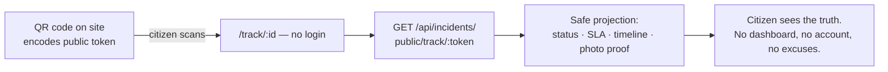
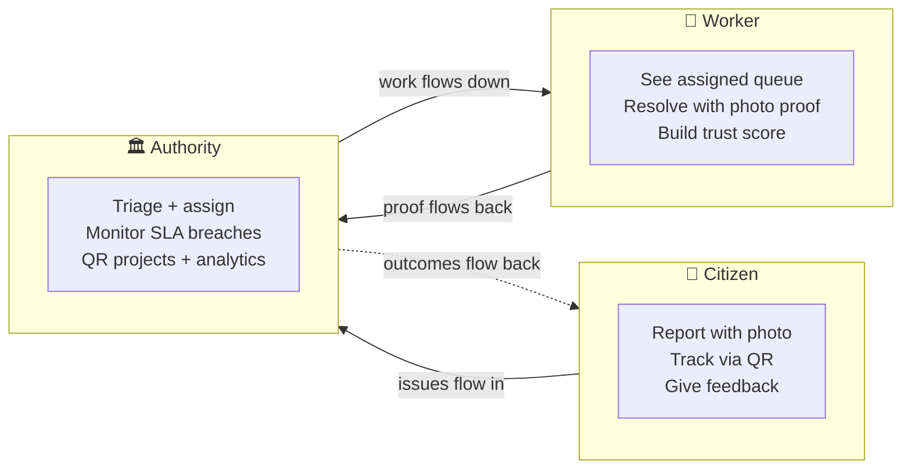

<p align="center">
  
</p>

<h1 align="center">Jān Samādhan · जन समाधान</h1>

<p align="center">
  <b>AI-powered civic issue redressal for Indian municipalities</b><br/>
  Snap a photo → AI triage → SLA-tracked resolution → public QR transparency.<br/>
  <sub><i>"जन शिकायत निवारण मंच" — the people's grievance redressal platform.</i></sub>
</p>

<div align="center">


[](https://github.com/nishanthere10/jansamadhaan-ai/actions/workflows/ci.yml)

</div>

<p align="center">
  
  <br/><sub>Photos: <a href="https://unsplash.com">Unsplash</a> · Logos: original project artwork</sub>
</p>

---

## 💡 The Problem

Every Indian municipality runs on paper grievances: complaints get phoned in, scribbled into registers, "lost" between departments, and citizens never learn the outcome. **Jān Samādhan** replaces that opacity with an accountable, measurable pipeline — every issue becomes a photo with GPS, a classified ticket with a **publicly visible SLA clock**, and a QR code anyone can scan to see exactly what happened.

| Without Jān Samādhan | With Jān Samādhan |
|---|---|
| Verbal complaints, no evidence | Geotagged photo + AI-verified description |
| Manual routing, days lost | Auto category + severity + department in seconds |
| No deadline, no accountability | Municipal SLA clock with public breach visibility |
| Citizen in the dark | Public QR tracker + WhatsApp confirmation |

## 🏗️ Architecture




## 🔄 The Life of a Complaint



### ⏱️ Municipal SLA Engine

Real deadlines, not vibes. The SLA engine (`backend/app/services/sla_service.py`, mirrored in `frontend/lib/sla.ts`) assigns every category a target window, tightened by severity:

| Category | Standard | Critical |
|---|---|---|
| 🗑️ Garbage · Open manhole | 12 h | 6 h |
| 💧 Water leak · Drainage · Streetlight | 24 h | 12 h |
| 🕳️ Pothole · Road damage | 48 h | 24 h |
| 🌳 Encroachment · Horticulture | 72 h | 36 h |

States: `ON TRACK` → `EXPIRING SOON` (< 3 h left) → `BREACHED` · `MET` · `CLOSED` · `UNKNOWN` — computed **identically server- and client-side**, powering the public tracker, worker queues, and authority analytics.

### 📡 How the QR tracker works



## 🧭 Role Journeys




## ✨ Feature Gallery

<table>
  <tr>
    <td width="33%" align="center">
      <br/>
      <b>📸 Snap &amp; Report</b><br/><sub>Photo + GPS in seconds — AI verifies the description against the image</sub>
    </td>
    <td width="33%" align="center">
      <br/>
      <b>🤖 AI Triage</b><br/><sub>Gemini 2.0 Flash vision + Groq classification &amp; translation, orchestrated by LangGraph</sub>
    </td>
    <td width="33%" align="center">
      <br/>
      <b>📊 Authority Analytics</b><br/><sub>SLA breach heat, duplicate clustering, department throughput</sub>
    </td>
  </tr>
  <tr>
    <td width="33%" align="center">
      <br/>
      <b>🏷️ QR Public Projects</b><br/><sub>Physical QR boards on assets — anyone scans, everyone sees the truth</sub>
    </td>
    <td width="33%" align="center">
      <br/>
      <b>💬 WhatsApp Intake</b><br/><sub>No app? No problem. Report and confirm entirely over WhatsApp</sub>
    </td>
    <td width="33%" align="center">
      <br/>
      <b>🦺 Worker Trust Loop</b><br/><sub>Resolution with photo proof builds a worker credibility metric</sub>
    </td>
  </tr>
</table>

## 🧰 Tech Stack

| Layer | Technology |
|---|---|
| **Frontend** | React 19 · TypeScript · Vite · Tailwind CSS 4 · shadcn/ui · Zustand · React Router (code-split) |
| **Backend** | FastAPI · Pydantic v2 · Uvicorn |
| **AI** | LangGraph orchestration · Gemini 2.0 Flash (vision) · Groq (classification / translation) |
| **Data & Auth** | Supabase Postgres (RLS) · Supabase Auth (JWT) · Supabase Storage |
| **Messaging** | Twilio WhatsApp Business API (webhook intake + confirmation) |
| **Quality** | pytest · ruff · vulture · knip · tsc strict · GitHub Actions CI |

## 🚀 Quickstart

**Prerequisites:** Node 18+, Python 3.10+, Git — plus a [Supabase](https://supabase.com) project and a [Groq](https://console.groq.com) API key *(optional: Gemini & Twilio for vision + WhatsApp)*.

```bash
# 1 · Clone
git clone https://github.com/nishanthere10/jansamadhaan-ai.git
cd jansamadhaan-ai

# 2 · Backend
cd backend
python -m venv .venv
.\.venv\Scripts\activate            # Windows  (macOS/Linux: source .venv/bin/activate)
pip install -r requirements.txt
copy .env.example .env              # add SUPABASE_URL, SUPABASE_SERVICE_ROLE_KEY, GROQ_API_KEY…
uvicorn app.main:app --reload       # → http://localhost:8000/docs

# 3 · Frontend
cd ../frontend
npm install
npm run dev                         # → http://localhost:5173
```

### 🔑 Environment Variables (backend `.env`)

| Variable | Purpose |
|---|---|
| `SUPABASE_URL` / `SUPABASE_SERVICE_ROLE_KEY` / `SUPABASE_ANON_KEY` / `SUPABASE_JWT_SECRET` | Database, auth & storage |
| `GEMINI_API_KEY` / `GEMINI_MODEL` (`gemini-2.0-flash`) | Vision analysis |
| `GROQ_API_KEY` / `GROQ_MODEL` | Classification & translation |
| `TWILIO_ACCOUNT_SID` / `TWILIO_AUTH_TOKEN` / `TWILIO_PHONE_NUMBER` | WhatsApp intake |
| `FRONTEND_URL` | Base URL used in QR codes & WhatsApp links |
| `ENVIRONMENT` | `production` (default) hardens auth & disables demo data; `DEV_AUTH_BYPASS` only works outside production |

## 🗺️ API Map

| Route | Endpoint | Auth |
|---|---|---|
| Auth | `POST /api/auth/signup · login · aadhar-login · logout` · `GET /me · /workers` | JWT |
| Incidents | `POST /upload` · `GET /{id}` · `PUT /{id}/status · /{id}/triage` · `GET /{id}/updates` · `POST /{id}/reprocess · /{id}/feedback` · `GET /reverse-geocode` | JWT |
| **Public** | `GET /api/incidents/public/track/{token}` — QR tracker, **no login** | 🌐 Public |
| AI | `POST /api/ai/translate · /classify · /vision/analyze` | JWT |
| QR Projects | `GET · PUT · DELETE /api/qr-projects/{id}` | Authority |
| Notifications | `PUT /api/notifications/{id}/read` | JWT |
| WhatsApp | Twilio webhook → media download → AI triage → incident creation | Signature |

## 🧪 Quality & CI

```bash
# Backend
cd backend && .\.venv\Scripts\activate
ruff check . && python -m pytest -q

# Frontend
cd frontend
npx tsc --noEmit && npm run build
```

GitHub Actions (`.github/workflows/ci.yml`) runs the gate on every push. Auth hardening, transactional resolution finalization, duplicate clustering, and the server-side SLA engine are covered by the phase audit in [`CURRENT_CODEBASE_REPORT.md`](CURRENT_CODEBASE_REPORT.md).

## 🗺️ Roadmap

- [x] LangGraph AI triage pipeline (vision + classify + translate)
- [x] Server-side SLA engine shared with the frontend
- [x] Public QR tracking with safe data projection
- [x] Transactional resolution finalization + audit trail
- [ ] Migration validation (006/007/008) — tracked in `remaining.md`
- [ ] Multi-language citizen UI beyond AI translation
- [ ] Municipal pilot with live SLA dashboards

## 🤝 Contributing

1. Fork → create a branch (`feature/my-feature`)
2. Run the quality gate locally (ruff · pytest · tsc · build)
3. Open a PR describing the *why*, not just the *what*

## 📄 License

MIT — see [`LICENSE`](LICENSE). Photos courtesy of [Unsplash](https://unsplash.com); project logos and product artwork are original assets of this repository.

---

<div align="center">
  <sub><b>जन समाधान</b> — because every citizen's complaint deserves a deadline. ⏱️🇮🇳</sub>
</div>


